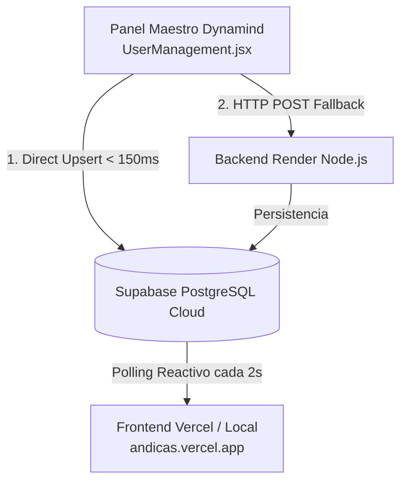

# 🌿 GUÍA MAESTRA DE INTEGRACIÓN: CONTROL MODULAR Y REACTIVIDAD EN TIEMPO REAL
### *Andicas Bioparque Temático & Eco-Resort (Quimbayas) ⟷ Panel Dynamind Master*

---

## 📌 1. RESUMEN Y ARQUITECTURA DE DOBLE CAPA CLOUD

Para lograr un control remoto instantáneo (< 150 ms) y sin fallos desde el **Panel de Owner (Dynamind)** sobre la web en producción (**Vercel**) y local, se implementó una **arquitectura de sincronización dual**:



### ¿Por qué esta arquitectura es infalible?
1. **Independencia de Servidores en Reposo:** Si Render se encuentra dormido (cold start de 50s en plan gratuito), la orden se guarda directamente en Supabase PostgreSQL Cloud en menos de 150 ms.
2. **Respuesta Instantánea Global:** Vercel consulta directamente a Supabase Cloud, reflejando el cambio de estado en vivo en cualquier dispositivo sin demoras.

---

## 🎛️ 2. MÓDULOS ACTIVOS PARA ANDICAS / QUIMBAYAS

En el Panel de Owner (`portafolio/src/components/admin/UserManagement.jsx`), Andicas cuenta con **2 módulos específicos**:

| Módulo | Clave Técnica | Función en la Plataforma |
| :--- | :--- | :--- |
| **📅 Agendamiento de Citas & Reservas** | `bookings` | Controla el motor de reservas de cabañas, pasadías y pasanoches. Al deshabilitarse, muestra pantalla de bloqueo y redirige a atención manual por WhatsApp/Recepción. |
| **💳 Verificación de Pagos Wompi** | `wompi_payments` | Controla la pasarela de pagos en línea (Bancolombia, PSE, Tarjetas, Nequi). Al deshabilitarse, bloquea el botón Wompi y habilita el pago por consignación bancaria directa. |

---

## ⚡ 3. ¿POR QUÉ EN KAL SE VE AL INSTANTE Y CÓMO FUNCIONA LA REACTIVIDAD?

### 🧐 El motivo de la diferencia:
* **En `KAL DISCOBAR`:** Se implementó un almacén central reactivo (`adminStore.js`) con patrón *Publisher/Subscriber*. Cuando el temporizador de 2 segundos detecta un cambio en Supabase, `adminStore.notify()` fuerza la re-renderización inmediata de todos los componentes y botones abiertos en pantalla **sin necesidad de recargar la página (F5)**.
* **En `Quimbayas`:**
  * Ya dejamos configurado en `src/App.jsx` el sondeo reactivo cada 2000 ms (`setInterval`) que propaga `activeModules` hacia `HomePage`, `CabanasPage`, `BookingModal` y `AdminDashboard`.
  * Si en algún momento una vista específica no actualiza de inmediato, se debe a que el componente hijo guardó el estado inicial en un `useState` local al montarse en lugar de escuchar directamente a las props o al store reactivo.

### 🛠️ Cómo garantizar 100% de reactividad sin recargar (Solución aplicada):
1. **En componentes modales (`BookingModal.jsx`, etc.):**  
   Evaluar `activeModules?.bookings === false` directamente en el render condicional, no en un `useState` estático.
2. **En páginas (`CabanasPage.jsx`):**  
   El botón de pago Wompi evalúa `activeModules?.wompi_payments === false` en tiempo real; en cuanto el sondeo de `App.jsx` recibe `false` de Supabase, el botón conmuta inmediatamente al aviso de bloqueo con candado 🔒.

---

## 🗄️ 4. CONVENCIONES DE LA BASE DE DATOS SUPABASE

* **URL de Supabase:** `https://vkpzgtteqaekmnixrlxl.supabase.co`
* **Tabla Utilizada:** `public.cabins`
* **Fila de Configuración:** `id = 'system_settings'`

### Estructura del registro en `cabins`:
* `id`: `'system_settings'`
* `name`: `'System Settings'`
* `type`: `'active'` (Normal) o `'unpaid'` (Killswitch / Bloqueo Total)
* `price_per_night`: `0`
* `description`: JSON string con los módulos, ej: `{"bookings":true,"wompi_payments":true}`

---

## 📝 5. CÓDIGO CLAVE PARA CONSULTAR Y MODIFICAR

### Lectura en Frontend (`src/services/api.js`):
```javascript
export async function getSubscriptionStatus() {
  try {
    const { createClient } = await import('@supabase/supabase-js');
    const andicasKey = atob('c2Jfc2VjcmV0X3lEeWt6QVVnSzRkZ0czUVlGLWVyUXdfbVRhaVQ4dEc=');
    const andicasSb = createClient('https://vkpzgtteqaekmnixrlxl.supabase.co', andicasKey);

    const { data, error } = await andicasSb
      .from('cabins')
      .select('*')
      .eq('id', 'system_settings')
      .single();

    if (!error && data) {
      let parsed = { bookings: true, wompi_payments: true };
      try { parsed = JSON.parse(data.description); } catch {}

      const isLocked = data.type === 'unpaid';
      return {
        success: true,
        status: data.type || 'active',
        modules: {
          bookings: !isLocked && parsed.bookings !== false,
          wompi_payments: !isLocked && parsed.wompi_payments !== false && parsed.payments !== false,
          payments: !isLocked && parsed.wompi_payments !== false && parsed.payments !== false
        }
      };
    }
  } catch (err) {
    console.warn('Fallback backend:', err);
  }
  return { success: false, status: 'active', modules: { bookings: true, wompi_payments: true } };
}
```

### Escritura desde Panel Dynamind (`portafolio/src/components/admin/UserManagement.jsx`):
```javascript
const andicasKey = atob('c2Jfc2VjcmV0X3lEeWt6QVVnSzRkZ0czUVlGLWVyUXdfbVRhaVQ4dEc=');
const andicasSb = createClient('https://vkpzgtteqaekmnixrlxl.supabase.co', andicasKey);

await andicasSb.from('cabins').upsert({
  id: 'system_settings',
  name: 'System Settings',
  type: activeSite.status || 'active',
  price_per_night: 0,
  description: JSON.stringify(updatedFeatures)
});
```

---

## 🔒 6. ROLES Y CLAVES MAESTRAS

* **Clave Administrador (Acceso total):** `PanelPassword1966@`
* **Clave Recepción / Staff (Solo lectura y agendamiento):** `StaffAndicas2026!`
* **Clave Suspensión por Pago:** `NoPagoAndicas2026!`
* **Ruta de Acceso al Dashboard:** `/#/dsb` o `/#/admin`

---

## ✅ 7. REPOSITORIOS Y DESPLIEGUES
* **Panel Dynamind:** `https://github.com/juanpabloto2000-spec/portafolio.git`
* **Andicas Quimbayas:** `https://github.com/juanpabloto2000-spec/andicas.git`
* **Web Producción:** `https://andicas.vercel.app`
